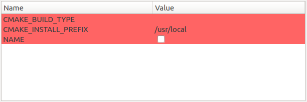
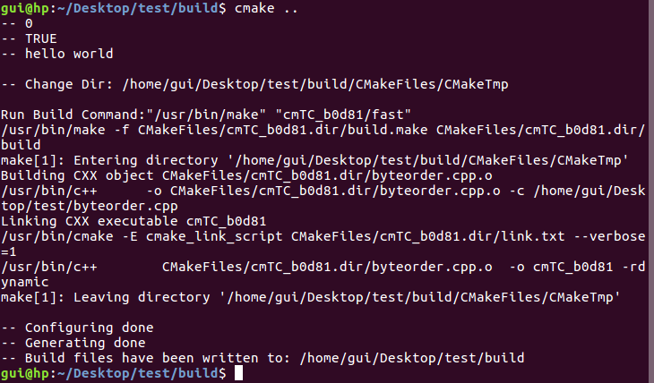

## CMake语言
CMake文件是由CMake语言编写的，文件名为CMakeLists.txt或者后缀为.camke的文件。CMake源文件分为三类：
* 目录(CMakeLists.txt)
* 脚本(`<script>.cmake`)
* 模块(`<module>.cmake`)

单个的CMake脚本可以使用-P命令行选项，在CMake脚本模式下运行。脚本模式下只是运行源文件中的命令，因此不允许在脚本中定义编译目标。下面的例子中，名为test.cmake的脚本包含以下内容：
``` cmake
# test.cmake
message(hello world)
add_executable(main main.cpp)
```
使用-P运行的截图如下所示：<br>
<br>

### Quoted Argument
CMake源文件由一条条命令组成，命令的参数分为Quoted Argument和Unquoted Argument。Quoted Argument的内容被一对双引号括起来，转义字符和变量引用都会被替换，Quoted Argument被当成单独的一个参数，下面是一个例子：
``` cmake
# test.cmake
set(variable hello world)
message(${variable})
message("${variable}")
message("This is a quoted argument containing multiple lines.
This is always one argument even though it contains a ; character.
Both \\-escape sequences and ${variable} references are evaluated.
The text does not end on an escaped double-quote like \".
It does end in an unescaped double quote.
")
```
运行的结果如下图：<br>
<br>

### Unquoted Argument
Unquoted Argumen 没有被引号包围，除非转义，否则不允许包含空格，括号，#，"或者\\。转义和变量引用会被替换。下面是一个例子：
``` cmake
set(var name)
foreach(arg
    NoSpace
    heh${var}
    Escaped\ Space
    This;Divides;Into;Five;Arguments
    Escaped\;Semicolon
    )
  message("${arg}")
endforeach()
```
输出结果为：<br>
<br>

## 3.2 目标(Targets)

CMake中最重要的就是目标。目标表示可执行文件，库以及一些由CMake生成的工具。每个add_library，add_executable和add_custom_target命令都会产生一个目标。例如下面的语句将产生一个foo静态库。

``` cmake
add_library(foo STATIC foo.cpp)
```

STATIC表明这个库必须被编译成静态库，相应的SHARED表明该库必须被编译成动态链接库。如果add_library命令没有给出STATIC或者SHARED参数，则CMake将根据变量BUILD_SHARED_LIBS的值将库编译成静态库或动态库。没有设置该变量时，默认生成静态库。如下面的例子所示：

``` cmake
# CMakeLists.txt
cmake_minimum_required(VERSION)
project(foo)

set(BUILD_SHARED_LIBS ON)
add_library(foo foo.cpp)
```

```c++
// foo.cpp
void foo(int a, int b, int& c) {
    c = a + b;
}
```

上面的项目编译后得到libfoo.so文件，注意set(BUILD_SHARED_LIBS ON)语句的位置，如果该语句在add_library命令之后，则仍将编译得到静态库。

还可以对目标使用get_target_property和set_target_properties命令，或者更一般的get_property和set_property命令来读取或者设置目标的属性。get_target_property命令的语法如下：

```cmake
get_target_property(VAR target property)
```
该命令获取目标的属性存储在变量VAR中，如果没有找到属性值，VAR的值为NOTFOUND。该命令能够从任何已创建的目标中获取属性值，不仅仅是当前的CMakeLists.txt文件中的目标。set_target_properties命令的语法如下所示：

```cmake
set_target_properties(
    target1 target2 ...
    PROPERTIES
    prop1 value1
    prop2 value2
    ...
)
```
可以通过设置目标的OUTPUT_NAME属性来设置目标的输出文件名，CMake要求逻辑上的目标名唯一，该方法可以让两个目标的使用相同的输出文件名（不含后缀）。还可以设置`<CONFIG>_OUTPUT_NAME`属性为不同的配置设置不同的文件名，比如DEBUG, RELEASE, MINSIZEREL, RELWITHDEBINFO配置。下面是两个例子。

> 3.2.1 get_property例子

``` cmake
# CMakeLists.txt
cmake_minimum_required(VERSION 3.0)
project(foo)

add_subdirectory(foo)
get_target_property(fooname foo OUTPUT_NAME)
message(${fooname})

add_executable(main main.cpp)
target_link_libraries(main foo)
```

``` cmake
# foo/CMakeLists.txt
add_library(foo foo.cpp)
set_target_properties(foo PROPERTIES OUTPUT_NAME bar)
```

foo/CMakeLists.txt添加了foo静态库，并为foo库设置了输出名bar，运行该配置会CMake打印信息bar，并在foo文件夹下生成libbar.a文件。如果将add_subdirectory命令放在message命令之后，则CMake会给出错误信息：<br>
`get_target_property() called with non-existent target "foo".`<br>
这是因为执行查询时，foo目标还没有被添加到项目中。还有一点需要注意的是，如果没有为foo目标设置输出名，则CMake将会输出fooname-NOTFOUND，不要想当然的认为没有设置OUTPUT_NAME属性则查询的结果是foo。

> 3.2.1 set_target_properties例子

```cmake
# CMakeLists.txt
cmake_minimum_required(VERSION 3.0)
project(foo)

add_subdirectory(foo)

add_executable(main main.cpp)
target_link_libraries(main foo)
set_target_properties(
    main
    PROPERTIES
    RELEASE_OUTPUT_NAME renderer_release
)
set_target_properties(
    main
    PROPERTIES
    DEBUG_OUTPUT_NAME renderer_debug
)

```

``` cmake
add_library(foo foo.cpp)
```

CMakeLists.txt在不同的配置下为目标main设置不同的输出名。需要注意的是变量CMAKE_BUILD_TYPE默认是没有设置的，虽然最后编译得到的结果和Debug配置相同，但是由于该变量没有设置，所以两条set_target_properties命令并不起作用，输出文件名还是main.out。如果想要设置生效务必设置CMAKE_BUILD_TYPE的值。有两种办法设置该变量的值，一种是通过命令set(CMAKE_BUILD_TYPE Release)，另一种是通过命令行cmake .. -DCMAKE_BUILD_TYPE=Release，这样输出文件名才会变成renderer_release。

## 3.5 变量和Cache

CMake变量的作用域和其他语言不同，和Shell脚本语言类似。变量对当前的CMakeLists文件，函数，子目录的CMakeLists文件，任何通过include命令引入的文件都有效。然而当CMake处理子目录和函数时会使用当前的环境初始化一个新的作用域。因此任何在子环境中对变量所做的修改都不会影响父目录。如果想要修改父目录的变量，可以为set命令加上PARENT_SCOPE参数。修改父环境的变量值不会影响自环境的变量，如下面的代码所示：
```cmake
set(name gui)
set(name jiangheng PARENT_SCOPE)
message(STATUS ${name})
```
这段代码输出gui。

有些时候希望用户能够设置一些值，这些值只能存储在cache条目中，用户通过交互式命令行或者图形界面对这些cache条目进行设置。可以通过set命令设置cache变量，语法如下：
```cmake
set(VAR ON CACHE BOOL "doc str")
```
可选的变量类型包括：BOOL，PATH，FILEPATH和STRING。有些时候希望限制cache变量的取值，可以通过设置cache变量的STRINGS属性实现，例如：
``` cmake
set(CRYPTOBACKEND "OpenSSL" CACHE STRING "select a cryptography backend")
set_property(CACHE CRYPTOBACKEND PROPERTY STRINGS "OpenSSL" "LibTomCrypt" "LibDES")
```
这样CRYPTOBACKEND变量只能取OpenSSL，LibTomCrypt或LibDES了。如果变量存在cache中，仍然可以通过set命令设置变量的值。只有当环境中不存在变量，才会查找cache中的变量。因此set命令只是设置当前的环境而没有修改cache中的值。通常不希望CMakeLists文件对cache中的变量做修改，因为这些变量是由用户通过图形界面设置的。因此set(VAR ON CACHE BOOL "doc")只在cache中不存在变量时才起作用，否则没有任何效果。如果确实想要修改cache中的变量，需要加上FORCE选项。

除了可以使用交互式命令行或者图形界面的方式设置CACHE变量之外，还可以通过命令行参数设置CACHE变量。形如-DCACHE_VAR:TYPE=VALUE的命令行参数将会设置CACHE变量CACHE_VAR的值为VALUE。VALUE的类型必须与TYPE匹配，形如-DNAME:BOOL=gui运行的结果如下：<br>
<br>
虽然没有报错，显然不是想要的结果。当确信设置的值正确时可以不要:TYPE，直接使用-DVAR=VALUE。

注意不要与gcc的使用混淆，gcc也支持-D命令行选项，用来设置编译器的预定义值。比如-DVAR将设置宏VAR的值为1，-DVAR=defintion将设置宏VAR的值为definition。而cmake的-D是用来设置cache变量。不过gcc -D的用法和cmake的add_definitions命令相似，第5.5节将对add_definitions进行介绍。

# 第四章 编写CMakeLists文件

> if命令

if支持一下操作：<br>
if(VAR)：当变量不是空，0，FALSE，OFF或者NOTFOUND时为真<br>
if(NOT VAR)：取反<br>
if(VAR1 AND VAR2)：取与<br>
if(VAR1 OR VAR2)：取或<br>
if(COMMAND command-name)：如果给定的参数是命令则返回真<br>
if(DEFINED VAR)：如果变量存在，不论变量的值是什么，返回真<br>
if(EXISTS path)：如果文件名或者路径名存在返回真<br>
if(IS_DIRECTORY name)：如果参数是目录则返回真，目录必须存在，否则返回假<br>
if(IS_ABSOLUTE name)：如果参数是绝对路径，不论路劲是否存在都返回真<br>
if(FILE1 IS_NEWER_THAN FILE2)：如果FILE1比FILE2更新，返回真<br>
if(VAR MATCHES regex)：如果变量匹配正则表达式，返回真，注意直接使用变量名，而不是${VAR}<br>

> 优先级

括号的优先级最高，然后是类似EXISTS，COMMAND，DEFINED等前缀，之后是EQUAL，LESS，GREATER，STREQUAL，STRLESS，STRGREATER和MATCHES等比较操作，再之后是NOT，最后是AND和OR。

> 真假值

OFF，0，NO，FALSE，N，NOTFOUND，\*-NOTFOUND IGNORE被认为是false<br>
ON，1，YES，TRUE，Y被认为是真<br>
注意不区分大小写，因此true，True和TURE都被认为是真<br>

> 函数和宏

函数和宏的功能类似，区别在于函数会生成一个新的作用域，宏不会。CMake会为函数定一些变量，如ARGC，ARGN，ARGV，ARGV0，ARGV1。下面的例子展示了这些变量的含义：
``` cmake
function(foo name age)
    message(STATUS "${ARGN}")
    message(STATUS ${ARGC})
    message(STATUS "${ARGV}")
    message(STATUS ${ARGV0})
    message(STATUS ${ARGV1})
    message(STATUS ${ARGV2})
    message(STATUS ${ARGV10})
endfunction()

foo(gui 23 33 44)
```
运行的结果如下：<br>
<br>

## 第五章 系统检查

> try_run命令

try_run命令尝试编译并运行代码，语法如下：

```
try_run(
    RUN_RESULT_VAR COMPILE_RESULT
    bindir srcfile [CMAKE_FLAGS <Flags>]
    [COMPILE_OUTPUT_VARIABLE comp]
    [RUN_OUTPUT_VARIABLE run]
    [OUTPUT_VARIABLE var]
    [ARGS <arg1> <arg2> ...]
)
```

try_run尝试编译一个源文件，将编译结果TRUE或者FALSE值存储到变量COMPILE_RESULT_VAR中。如果编译成功，执行可执行文件，将退出码存储到变量RUN_RESULT_VAR中。如果编译成功，但是执行失败RUN_RESULT_VAR的值被设置成FAILED_TO_RUN. COMPILE_RESULT_VARIABLE存储编译期的输出，RUN_OUTPUT_VARIABLE存储可执行文件的输出。出于兼容性的考虑，保留了OUTPUT_VARIABLE，该变量存储编译和执行的输出，不过该变量不能和COMPILE_OUTPUT_VARIABLE或者RUN_OUTPUT_VARIABLE同时使用。下面是一个例子：

> 使用try_run检查机器的字节序

``` c++
#include <iostream>
using namespace std;

int main() {
    union {
        long l;
        char c[sizeof(long)];
    } u;
    u.l = 1;
    cout << "hello world" << endl;
    return u.c[sizeof(long) - 1] == 1;
}
```

``` cmake
cmake_minimum_required(VERSION 3.0)
project(gtest)

try_run(RUN_RESULT_VAR COMPILE_RESULT_VAR
	${CMAKE_BINARY_DIR}
	${PROJECT_SOURCE_DIR}/byteorder.cpp
	RUN_OUTPUT_VARIABLE RUN_OUTPUT
	COMPILE_OUTPUT_VARIABLE COMPILE_OUTPUT
)

message(STATUS ${RUN_RESULT_VAR})
message(STATUS ${COMPILE_RESULT_VAR})
message(STATUS ${RUN_OUTPUT})
message(STATUS ${COMPILE_OUTPUT})
```

输出的结果如下所示：<br>
<br>

上面的代码中使用了PROJECT_SOURCE_DIR，PROJECT_SOURCE_DIR和CMAKE_SOURCE_DIR的区别在于，CMAKE_SOURCE_DIR只最顶层的CMakeLists.txt所在的目录，而PROJECT_SOURCE_DIR则是指最近的project()命令所在的目录。下面的例子中展示两者的区别：

> PROJECT_SOURCE_DIR和CMAKE_SOURCE_DIR的区别
``` cmake
# CMakeLists.txt
cmake_minimum_required(VERSION 3.0)
project(gtest)

message(STATUS ${CMAKE_SOURCE_DIR})
message(STATUS ${PROJECT_SOURCE_DIR})

add_subdirectory(foo)
add_executable(gtest main.cpp)
target_link_libraries(gtest foo)
```

``` cmake
# foo/CMakeLists.txt
project(foo)
add_library(foo foo.cpp)

message(STATUS ${CMAKE_SOURCE_DIR})
message(STATUS ${PROJECT_SOURCE_DIR})
```

输出结果如下：

```
-- C:/Users/gui/Desktop/test
-- C:/Users/gui/Desktop/test
-- C:/Users/gui/Desktop/test
-- C:/Users/gui/Desktop/test/foo
```
一个项目可以包含多个project，每个project命令对应visual studio的sln文件。下面几幅图是在Windows下面运行cmake的结果：<br>
> build/getst目录

<br>

> build/getst/foo目录

<br>

> Visual Studio Solution面板

<br>

### 5.5 为编译传递值

可以通过add_definitions命令为编译器定义预编译值，用法和gcc -D命令行选项类似。add_definitions(-DVAR)将设置预编译宏VAR，add_definitions(-DVAR=VALUE)将为预编译宏VAR设置值。当调用add_definitions命令时，会为当前目录设置预定义值，当add_subdirectory进入子目录时，将会使用当前的预定义值初始化子目录。如果想要更细腻的控制，可以使用目录，目标以及源文件定义的COMPILE_DEFINITIONS属性，比如：
``` cmake
add_library(mylib src1.c src2.c)
add_executable(myexe main1.c)
set_property(
    DIRECTORY
    PROPERTY COMPILE_DEFINITIONS A AV=1
)
set_property(
    TARGET mylib
    PROPERTY COMPILE_DEFINITIONS B BV=2
)
set_property(
    SOURCE src1.c
    PROPERTY COMPILE_DEFINITIONS C CV=3
)
```
将会为源文件设置以下宏：<br>
```
src1.c：-DA -DAV=1 -DB -DBV=2 -DC -DCV=3
src2.c：-DA -DAV=1 -DB -DBV=2
main1.c：-DA -DAV=1
```
需要注意的是set_property将用新值替代旧值，APPEND选项将添加值而不是替旧值。比如：
``` cmake
set_property(
    SOURCE sr1.c
    APPEND PROPERTY COMPILE_DEFINITIONS D DV=4
)
```
将为src1.c添加预编译"-DD -DDV=4"。还可以通过COMPILE_DEFINITIONS_<CONFIG>为不同的配置设置预编译值。

另一种方法是通过配置文件的方式。配置文件的方式需要使用configure_file命令，该命令接受两个参数，一个指定输入文件的位置，另一个指定输出文件的位置。可以通过以下方式在输入文件中设置预定义值：<br>
> `#cmakedefine VAR`<br>
如果cmake中变量VAR的值为真，那么生成文件将包含该一行：#define VAR。<br>

> `${VAR}` 或者 @VAR@
使用cmake中VAR变量的值替换掉

因为有些语言可能有${}的语法，因此可以通过@ONLY的选项告诉cmake只对@VAR@进行替换。
